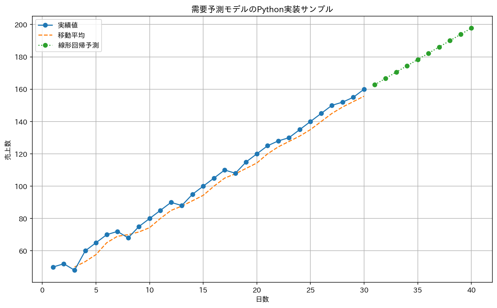

# python-demand-forecast-portfolio
Pythonによる需要予測モデルのサンプルです。
# Pythonによる需要予測モデル実装ポートフォリオ

作成者: Logical Code .Y

## 概要
クラウドソーシング案件「PythonによるAI需要予測サービス開発（数式プログラム化）」への応募にあたり作成した、自身の技術力を示すためのポートフォリオです。

## 実行結果
このリポジトリのコードを実行すると、以下の予測グラフが出力されます。



## ポートフォリオ本体
詳細な実装や解説は、以下のJupyter Notebookファイルをご覧ください。
→ **[demand_forecast_portfolio.ipynb](demand_forecast_portfolio.ipynb)**

## このポートフォリオで示したスキル
- **数式のプログラム化能力:**
  - `scikit-learn`に頼らず、NumPyを用いて最小二乗法の**正規方程式**をゼロから実装しました。数値的安定性を考慮し、逆行列計算には疑似逆行列(`pinv`)を用いています。
  - 
- **コードの可読性・再利用性:**
  - 処理を関数化し、誰が読んでも理解しやすいようにコメントを記述しました。
  - 
- **問題解決能力:**
  - 実行環境に依存する日本語の文字化け問題を、外部ライブラリ(`japanize-matplotlib`)を用いてスマートに解決しました。

## 再現方法
**1. Google Colaboratoryで開く:**
[](https://colab.research.google.com/github/Logical-Code-Y/python-demand-forecast-portfolio/blob/main/demand_forecast_portfolio.ipynb)

**2. ローカル環境で実行:**
```bash
git clone https://github.com/Logical-Code-Y/python-demand-forecast-portfolio.git
cd python-demand-forecast-portfolio
pip install -r requirements.txt
# jupyter notebook demand_forecast_portfolio.ipynb を開いて実行
